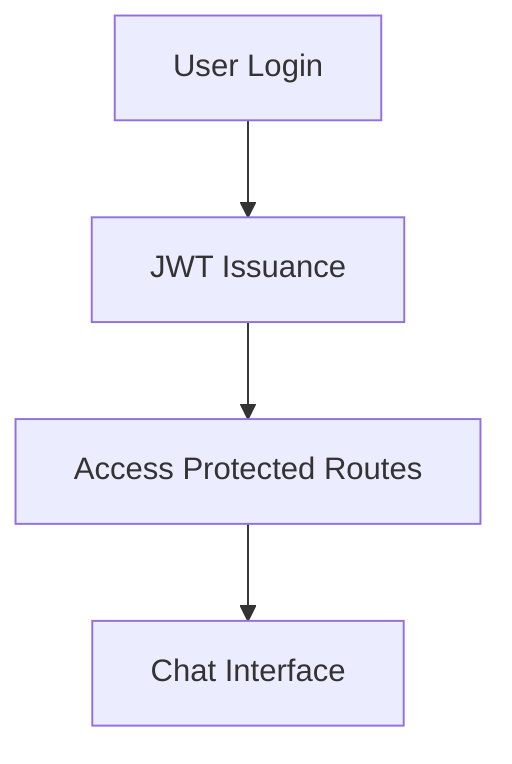
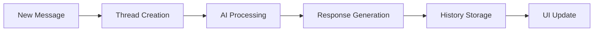

# NEXUS AI – Full-Stack AI Chat Application

<div align="center">


**A sophisticated conversational AI platform built with modern web technologies**

[Features](#-features) • [Tech Stack](#-tech-stack) • [Quick Start](#-quick-start) • [Deployment](#-deployment) • [API](#-api-endpoints)

</div>

## 🌟 Overview

Yourseas AI is a production-ready full-stack conversational AI application that delivers a seamless chat experience. Built with cutting-edge technologies, it features intelligent conversation threading, secure authentication, and a beautiful responsive interface.


## ✨ Features

### 🤖 AI Chat Excellence
- **Gemini 2.5 Flash Integration** - Real-time conversational AI with smooth message rendering
- **Typing Indicators & Auto-scroll** - Enhanced user experience with visual feedback
- **Streaming Responses** - Live AI response delivery

### 🔐 Secure Authentication
- **JWT-based Authentication** - Secure login with email/password
- **Protected Routes** - Automatic redirect logic based on authentication state
- **Session Management** - Persistent user sessions

### 💬 Intelligent Threading
- **Multi-thread Conversations** - Organize chats into separate threads
- **Auto-generated Titles** - Smart thread naming based on conversation content
- **Thread Management** - Easy switching, creation, and deletion of conversations

### 🎨 Beautiful Interface
- **Glassmorphism Design** - Stunning sidebar with modern visual effects
- **Fully Responsive** - Perfect experience across all devices
- **Light/Dark Mode Ready** - Built with Tailwind CSS for theme compatibility

### 📚 Additional Pages
- **Documentation** - Comprehensive project documentation
- **Contact Form** - Clean, functional contact interface
- **Welcome Screen** - Engaging first-time user experience

## 🛠 Tech Stack

### Frontend
| Technology | Purpose |
|------------|---------|
| **React + TypeScript** | Type-safe component architecture |
| **Tailwind CSS** | Utility-first styling system |
| **React Router** | Client-side routing |
| **LocalStorage** | Client-side state persistence |

### Backend
| Technology | Purpose |
|------------|---------|
| **Node.js + Express** | Robust server framework |
| **MongoDB + Mongoose** | Database with ODM |
| **JWT** | Secure authentication |
| **Google Gemini API** | AI conversation engine |

## 🚀 Quick Start

### Prerequisites
- Node.js 16+ 
- MongoDB instance
- Google Gemini API key

### Backend Setup

```bash
# Clone and setup backend
cd backend
npm install

# Environment configuration
cp .env.example .env
```

**Environment Variables:**
```env
MONGO_URI=your_mongodb_connection_string
JWT_SECRET=your_jwt_secret_key
GEMINI_API_KEY=your_gemini_api_key
PORT=5000
```

```bash
# Start development server
npm run dev
```

### Frontend Setup

```bash
# Clone and setup frontend  
cd frontend
npm install

# Environment configuration
cp .env.example .env
```

**Environment Variables:**
```env
VITE_API_URL=http://localhost:5000/api
```

```bash
# Start development server
npm run dev
```

## 📁 Project Structure

```
yourseas-ai/
├── frontend/
│   ├── src/
│   │   ├── components/          # Reusable UI components
│   │   │   ├── Chat.tsx
│   │   │   ├── Sidebar.tsx
│   │   │   ├── Login.tsx
│   │   │   └── Welcome.tsx
│   │   ├── pages/              # Route components
│   │   │   ├── Documentation.tsx
│   │   │   └── ContactPage.tsx
│   │   └── utils/              # Helper functions
│   │       └── thread.ts
│   └── App.tsx
└── backend/
    ├── src/
    │   ├── controllers/        # Business logic
    │   │   ├── aiController.ts
    │   │   ├── threadController.ts
    │   │   └── authController.ts
    │   ├── models/             # Database schemas
    │   │   ├── historyModels.ts
    │   │   ├── threadModel.ts
    │   │   └── userModel.ts
    │   ├── middleware/         # Express middleware
    │   │   └── auth.ts
    │   ├── utils/              # Utility functions
    │   │   └── aiClient.gemini.ts
    │   ├── routes/             # API routes
    │   │   ├── aiRoutes.ts
    │   │   └── authRoutes.ts
    │   └── server.ts          # Server entry point
    └── package.json
```

## 🔄 How It Works

### 1. Authentication Flow


### 2. Conversation Management


### 3. Data Persistence
- **Threads** stored with metadata (title, timestamps)
- **Messages** saved with conversation context
- **User sessions** maintained via JWT tokens

## 🚀 Deployment

### Backend (Render/Railway/AWS)

1. **Push to GitHub**
   ```bash
   git add .
   git commit -m "Deploy ready"
   git push origin main
   ```

2. **Platform Setup**
   - Connect your GitHub repository
   - Set build command: `npm install`
   - Set start command: `npm start`

3. **Environment Variables**
   ```env
   MONGO_URI=your_production_mongo_url
   GEMINI_API_KEY=your_gemini_key
   JWT_SECRET=your_production_secret
   ```

### Frontend (Vercel/Netlify)

1. **Repository Import**
   - Import your frontend repository
   - Set build settings automatically

2. **Environment Configuration**
   ```env
   VITE_API_URL=https://your-backend-url.com/api
   ```

3. **Deploy**
   - Automatic deployments on git push
   - Custom domain configuration available

## 🔌 API Endpoints

### AI & Chat Endpoints
| Method | Endpoint | Description |
|--------|----------|-------------|
| `POST` | `/api/ai/query` | Send prompt & receive AI response |
| `GET` | `/api/ai/history` | Retrieve thread message history |
| `GET` | `/api/ai/threads` | Get all user threads |
| `DELETE` | `/api/ai/threads/:threadId` | Delete thread and messages |

### Authentication Endpoints
| Method | Endpoint | Description |
|--------|----------|-------------|
| `POST` | `/auth/login` | User login |
| `POST` | `/auth/signup` | User registration |

## 🎯 Usage Examples

### Starting a New Chat
1. Log into your account
2. Click "New Chat" in sidebar
3. Begin conversation - thread title auto-generates
4. Switch between threads seamlessly

### Managing Conversations
- **View All Threads**: Sidebar displays all conversations
- **Delete Threads**: Use three-dot menu for thread options
- **Auto-save**: All messages persist automatically

## 📸 Application Preview

<div align="center">

### Welcome Page


### Login / Signup Page


### Chat Interface


### Sidebar Navigation  


### Mobile Responsive


</div>

## 🛣 Roadmap & Future Enhancements

### Coming Soon
- [ ] Real-time streaming responses (Server-Sent Events)
- [ ] Thread renaming capability
- [ ] Theme switcher (light/dark mode)
- [ ] Chat sharing via unique links
- [ ] Enhanced mobile layout optimizations

### Potential Features
- [ ] File upload support
- [ ] Voice message integration
- [ ] Collaborative chat rooms
- [ ] Advanced AI model selection

## 🐛 Troubleshooting

### Common Issues

1. **Authentication Failures**
   - Verify JWT secret matches between frontend/backend
   - Check token expiration settings

2. **Database Connection**
   - Confirm MongoDB URI format
   - Ensure network access to database

3. **AI Service Errors**
   - Validate Gemini API key
   - Check API rate limits

### Getting Help
- Check application logs for detailed error messages
- Verify all environment variables are set
- Ensure all dependencies are properly installed

## 👥 Contributing

We welcome contributions! Please feel free to submit pull requests or open issues for bugs and feature requests.

## 📄 License

This project is licensed under the MIT License - see the [LICENSE](LICENSE) file for details.

---

<div align="center">

**Built with ❤️ using modern web technologies**

*React • Node.js • MongoDB • Gemini AI • Tailwind CSS*

[Report Bug](https://github.com/yourusername/yourseas-ai/issues) • [Request Feature](https://github.com/yourusername/yourseas-ai/issues)

</div>