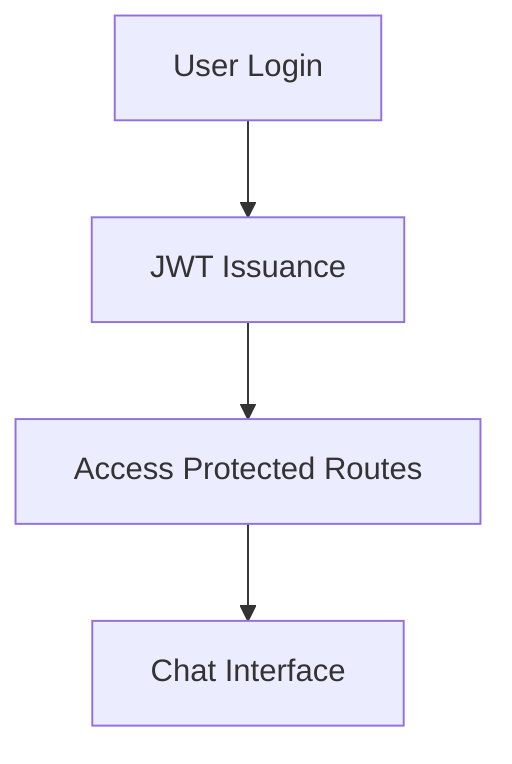

# NEXUS AI – Full-Stack AI Chat Application

<div align="center">


**An intelligent conversational AI platform with long-term memory and semantic understanding**

[Features](#-features) • [Tech Stack](#-tech-stack) • [Quick Start](#-quick-start) • [Deployment](#-deployment) • [API](#-api-endpoints)

</div>

## 🌟 Overview

NEXUS AI is a production-ready full-stack conversational AI application that delivers a seamless chat experience with **long-term memory and semantic intelligence**. Built with cutting-edge technologies, it features intelligent conversation threading, semantic memory retrieval, and a beautiful responsive interface.

<video width="1000" controls>
  <source src="https://github.com/jaycodes2/NEXUS_AI/raw/refs/heads/main/Complete%20working.mp4" type="video/mp4">
</video>

## ✨ Features

### 🤖 AI Chat Excellence
- **Gemini 2.5 Flash Integration** - Real-time conversational AI with smooth message rendering
- **Typing Indicators & Auto-scroll** - Enhanced user experience with visual feedback
- **Streaming Responses** - Live AI response delivery

### 🧠 **Long-Term AI Memory & Intelligence**
- **Semantic Memory with Vector Search** – All prompts and responses are embedded and stored using MongoDB Atlas Vector Search for meaning-based retrieval
- **Retrieval-Augmented Generation (RAG)** – AI retrieves relevant past conversations before generating context-aware responses
- **Cross-Thread Memory Recall** – AI references information from any previous conversation thread
- **Hallucination-Safe Memory Usage** – Transparent responses when no relevant memory exists
- **Semantic Chat History Search** – Search past conversations by meaning, not exact keywords
- **Ask My Past Chats** – Dedicated memory-query mode for asking questions about past conversations
- **Smart Thread Intelligence** – AI-generated summaries and semantic thread renaming

### 🔐 Secure Authentication
- **JWT-based Authentication** - Secure login with email/password
- **Protected Routes** - Automatic redirect logic based on authentication state
- **Session Management** - Persistent user sessions

### 💬 Intelligent Threading
- **Multi-thread Conversations** - Organize chats into separate threads
- **Auto-generated Titles** - Smart thread naming based on conversation content
- **Thread Management** - Easy switching, creation, and deletion of conversations
- **🧠 Semantic Thread Organization** – Threads remain organized with automatic summaries and intelligent renaming

### 🎨 Beautiful Interface
- **Glassmorphism Design** - Stunning sidebar with modern visual effects
- **Fully Responsive** - Perfect experience across all devices
- **Light/Dark Mode Ready** - Built with Tailwind CSS for theme compatibility

### 📚 Additional Pages
- **Documentation** - Comprehensive project documentation
- **Contact Form** - Clean, functional contact interface
- **Welcome Screen** - Engaging first-time user experience

## 🛠 Tech Stack

### Frontend
| Technology | Purpose |
|------------|---------|
| **React + TypeScript** | Type-safe component architecture |
| **Tailwind CSS** | Utility-first styling system |
| **React Router** | Client-side routing |
| **LocalStorage** | Client-side state persistence |

### Backend
| Technology | Purpose |
|------------|---------|
| **Node.js + Express** | Robust server framework |
| **MongoDB + Mongoose** | Database with ODM |
| **MongoDB Atlas Vector Search** | Semantic memory storage and retrieval |
| **JWT** | Secure authentication |
| **Google Gemini API** | AI conversation and embedding engine |

### AI & Memory
| Technology | Purpose |
|------------|---------|
| **Google Gemini 2.5 Flash** | Primary conversation model |
| **Vector Embeddings** | Semantic representation of conversations |
| **RAG (Retrieval-Augmented Generation)** | Context-aware response generation |
| **Semantic Search** | Meaning-based conversation retrieval |

## 🚀 Quick Start

### Prerequisites
- Node.js 16+ 
- MongoDB Atlas (with Vector Search enabled)
- Google Gemini API key

### Backend Setup

```bash
# Clone and setup backend
cd backend
npm install

# Environment configuration
cp .env.example .env
```

**Environment Variables:**
```env
MONGO_URI=your_mongodb_atlas_connection_string
JWT_SECRET=your_jwt_secret_key
GEMINI_API_KEY=your_gemini_api_key
PORT=5000
# Vector Search Configuration
VECTOR_SEARCH_INDEX_NAME=conversation_embeddings
EMBEDDING_MODEL=embedding-001
```

```bash
# Start development server
npm run dev
```

### Frontend Setup

```bash
# Clone and setup frontend  
cd frontend
npm install

# Environment configuration
cp .env.example .env
```

**Environment Variables:**
```env
VITE_API_URL=http://localhost:5000/api
```

```bash
# Start development server
npm run dev
```

## 📁 Project Structure

```
nexus-ai/
├── frontend/
│   ├── src/
│   │   ├── components/          # Reusable UI components
│   │   │   ├── Chat.tsx
│   │   │   ├── Sidebar.tsx
│   │   │   ├── Login.tsx
│   │   │   ├── Welcome.tsx
│   │   │   └── MemorySearch.tsx  # Semantic search interface
│   │   ├── pages/              # Route components
│   │   │   ├── Documentation.tsx
│   │   │   └── ContactPage.tsx
│   │   └── utils/              # Helper functions
│   │       └── thread.ts
│   └── App.tsx
└── backend/
    ├── src/
    │   ├── controllers/        # Business logic
    │   │   ├── aiController.ts
    │   │   ├── threadController.ts
    │   │   ├── authController.ts
    │   │   └── memoryController.ts  # Memory management
    │   ├── models/             # Database schemas
    │   │   ├── historyModels.ts
    │   │   ├── threadModel.ts
    │   │   ├── userModel.ts
    │   │   └── memoryModel.ts  # Vector embeddings
    │   ├── middleware/         # Express middleware
    │   │   └── auth.ts
    │   ├── utils/              # Utility functions
    │   │   ├── aiClient.gemini.ts
    │   │   ├── embeddingUtils.ts  # Vector embedding utilities
    │   │   └── memoryRetrieval.ts # RAG implementation
    │   ├── routes/             # API routes
    │   │   ├── aiRoutes.ts
    │   │   ├── authRoutes.ts
    │   │   └── memoryRoutes.ts    # Memory search endpoints
    │   └── server.ts          # Server entry point
    └── package.json
```

## 🔄 How It Works

### 1. Authentication Flow


### 2. Conversation with Memory


### 3. Memory Intelligence Workflow
- **Message Storage**: Each message generates vector embeddings
- **Semantic Retrieval**: Vector search finds relevant past conversations
- **RAG Context**: Retrieved memories enrich current prompt
- **Intelligent Responses**: AI responds with full conversation context

## 🧠 Memory Features in Detail

### Semantic Memory System
- **Vector Embeddings**: Convert conversations to numerical representations
- **Atlas Vector Search**: MongoDB's built-in semantic search capability
- **Relevance Scoring**: Cosine similarity for finding related conversations

### Memory Query Examples
```javascript
// Search past conversations semantically
POST /api/memory/search
{
  "query": "Where did I discuss MongoDB vector search?",
  "userId": "user123",
  "limit": 5
}

// Ask about past chats
POST /api/memory/query
{
  "question": "What problems did I face while building this project?",
  "userId": "user123"
}
```

### Smart Thread Management
- **Auto-Summarization**: Periodically generate thread summaries using AI
- **Semantic Renaming**: Update thread titles based on evolving conversation context
- **Cross-Thread Awareness**: AI understands connections between different conversations

## 🚀 Deployment

### Backend (Render/Railway/AWS)

1. **Push to GitHub**
   ```bash
   git add .
   git commit -m "Deploy ready"
   git push origin main
   ```

2. **Platform Setup**
   - Connect your GitHub repository
   - Set build command: `npm install`
   - Set start command: `npm start`

3. **Environment Variables**
   ```env
   MONGO_URI=your_production_mongo_atlas_url
   GEMINI_API_KEY=your_gemini_key
   JWT_SECRET=your_production_secret
   VECTOR_SEARCH_INDEX_NAME=conversation_embeddings
   EMBEDDING_MODEL=embedding-001
   ```

### Frontend (Vercel/Netlify)

1. **Repository Import**
   - Import your frontend repository
   - Set build settings automatically

2. **Environment Configuration**
   ```env
   VITE_API_URL=https://your-backend-url.com/api
   ```

3. **Deploy**
   - Automatic deployments on git push
   - Custom domain configuration available

## 🔌 API Endpoints

### AI & Chat Endpoints
| Method | Endpoint | Description |
|--------|----------|-------------|
| `POST` | `/api/ai/query` | Send prompt & receive AI response with memory context |
| `GET` | `/api/ai/history` | Retrieve thread message history |
| `GET` | `/api/ai/threads` | Get all user threads |
| `DELETE` | `/api/ai/threads/:threadId` | Delete thread and messages |

### 🧠 Memory & Semantic Search Endpoints
| Method | Endpoint | Description |
|--------|----------|-------------|
| `POST` | `/api/memory/search` | Semantic search across all conversations |
| `POST` | `/api/memory/query` | Ask questions about past conversations |
| `POST` | `/api/memory/summarize` | Generate thread summaries |
| `GET` | `/api/memory/stats` | Get memory usage statistics |

### Authentication Endpoints
| Method | Endpoint | Description |
|--------|----------|-------------|
| `POST` | `/auth/login` | User login |
| `POST` | `/auth/signup` | User registration |

## 🎯 Usage Examples

### Starting a New Chat with Memory
1. Log into your account
2. Click "New Chat" in sidebar
3. Begin conversation - AI remembers past relevant discussions
4. Switch between threads seamlessly

### Using Semantic Search
```javascript
// Find related conversations
"Show me where I discussed authentication implementation"

// Query your own memory
"What deployment challenges have I faced before?"

// Get summaries
"Summarize my last 5 conversations about database design"
```

### Memory-Powered Conversations
- **Context Retention**: AI remembers technical details from weeks ago
- **Cross-Thread References**: "As we discussed in our API design conversation..."
- **Semantic Understanding**: Finds related topics even with different terminology

## 📸 Application Preview

<div align="center">

### Welcome Page


### Login / Signup Page


### Chat Interface with Memory Context


### Sidebar Navigation with Memory Search


### Mobile Responsive

</div>


## 🐛 Troubleshooting

### Common Issues

1. **Vector Search Configuration**
   - Verify MongoDB Atlas Vector Search is enabled
   - Check vector index creation and permissions
   - Ensure embedding model is properly configured

2. **Memory Retrieval Issues**
   - Check embedding generation is working
   - Verify similarity thresholds are appropriate
   - Monitor memory storage limits

3. **Authentication Failures**
   - Verify JWT secret matches between frontend/backend
   - Check token expiration settings

4. **Database Connection**
   - Confirm MongoDB Atlas URI format
   - Ensure network access to database

5. **AI Service Errors**
   - Validate Gemini API key
   - Check API rate limits

### Memory System Debugging
```bash
# Check memory statistics
curl -X GET http://localhost:5000/api/memory/stats \
  -H "Authorization: Bearer YOUR_TOKEN"

# Test semantic search
curl -X POST http://localhost:5000/api/memory/search \
  -H "Content-Type: application/json" \
  -H "Authorization: Bearer YOUR_TOKEN" \
  -d '{"query": "test query", "limit": 3}'
```


## 👥 Contributing

We welcome contributions! Please feel free to submit pull requests or open issues for bugs and feature requests.

### Memory System Contributions
- Vector search optimization
- RAG prompt engineering improvements
- Memory compression techniques
- UI enhancements for memory visualization

## 📄 License

This project is licensed under the MIT License - see the [LICENSE](LICENSE) file for details.

---

<div align="center">

**Built with ❤️ using modern web technologies**

*React • Node.js • MongoDB Atlas • Vector Search • Gemini AI • Tailwind CSS*

[Report Bug](https://github.com/yourusername/nexus-ai/issues) • [Request Feature](https://github.com/yourusername/nexus-ai/issues)

</div>